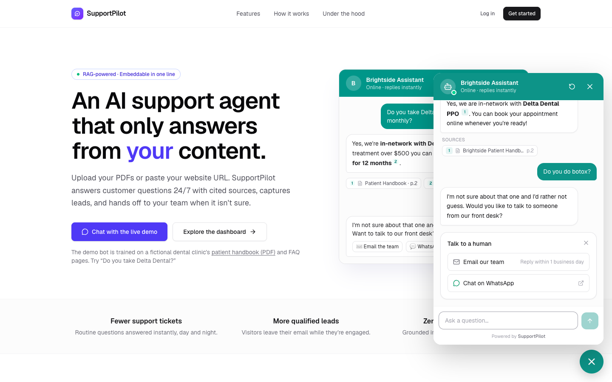
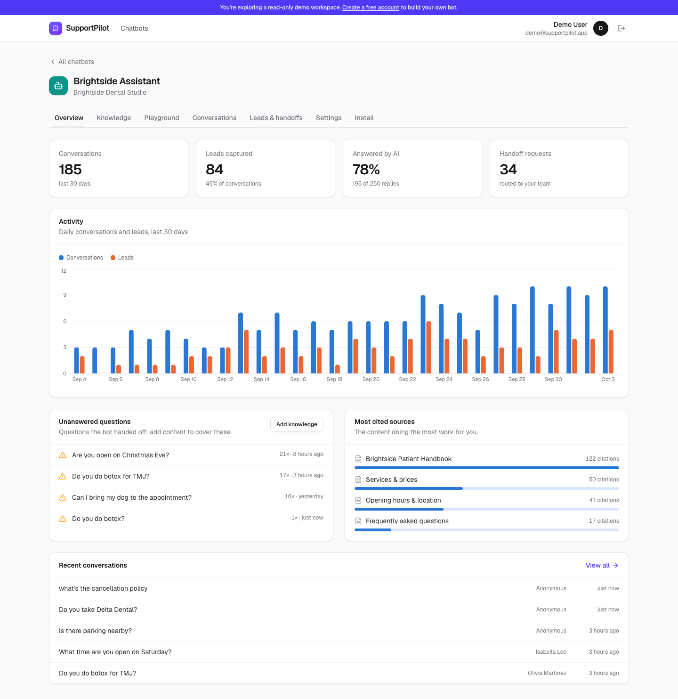
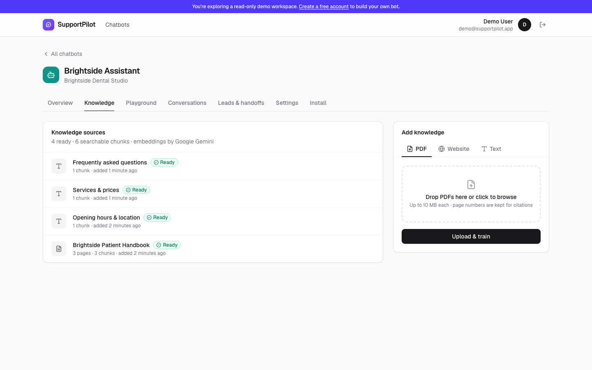
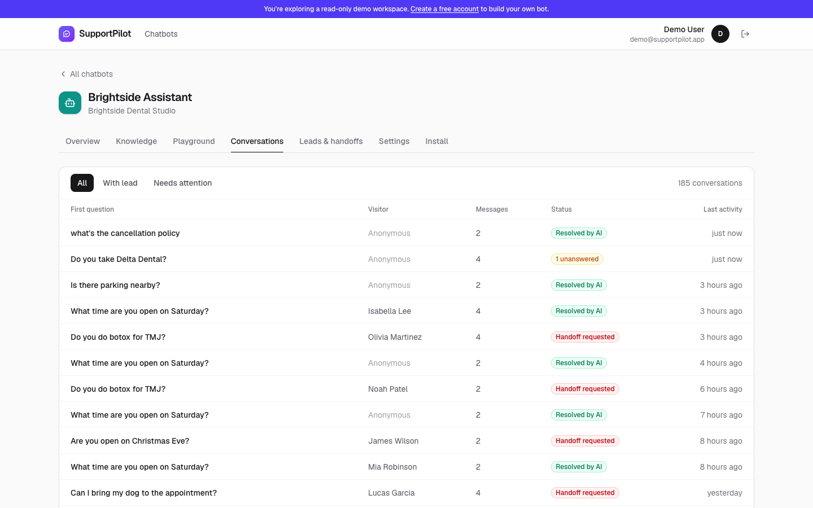
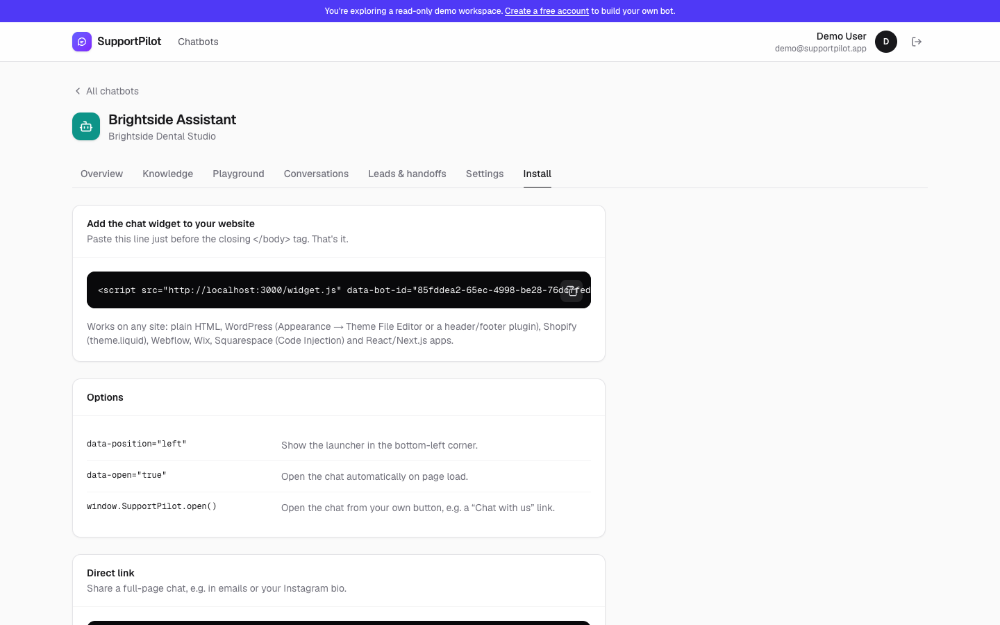
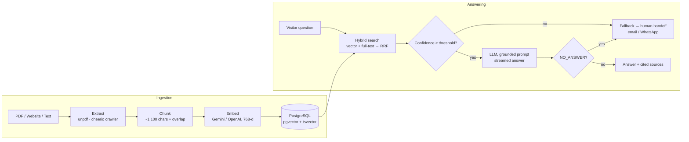

# SupportPilot: AI support chatbot trained on your own content

An AI customer-support agent that a business trains on **its own PDFs and website**, embeds on its site with **one script tag**, and that answers **only from that content, with cited sources**. When it isn't confident, it hands the visitor to a human by **email or WhatsApp**. Along the way it captures **leads** and shows **analytics**, including the questions your content doesn't cover yet.



> **Live demo: [supportpilot-nine.vercel.app](https://supportpilot-nine.vercel.app)**. Click **"Chat with the live demo"**, and ask the fictional *Brightside Dental Studio* bot something like *"Do you take Delta Dental?"* or *"How much is whitening?"*. Then click **"Explore the dashboard"** for the read-only admin view.

---

## Features

| | |
|---|---|
| **Knowledge ingestion** | Upload PDFs (page numbers preserved), crawl a website (sitemap + internal links, same-host, SSRF-guarded), or paste text. Processing runs in the background with live status. |
| **RAG with pgvector** | Content is chunked with overlap, embedded (768-d) and stored in PostgreSQL + **pgvector** (HNSW index). |
| **Hybrid retrieval** | Vector similarity **plus** Postgres full-text search, merged with **Reciprocal Rank Fusion**, so exact terms like prices, plan names and SKUs aren't lost. |
| **Grounded answers + citations** | Streamed answers cite numbered sources (`[1]`, `[2]`) that render as clickable chips with document title, page number or URL. |
| **No hallucinations by design** | Two guards: a per-bot **confidence threshold** on retrieval similarity, and a strict prompt where the model must return `[NO_ANSWER]` if the context doesn't contain the answer. Both trigger the human handoff. |
| **Human handoff** | "Talk to a human" by **email** (the business gets the full transcript and a dashboard link) or **WhatsApp** (`wa.me` deep link). |
| **Lead capture** | Ask for name and email **before** the chat, **during** it (after the first useful answer), or not at all. CSV export with formula-injection protection. |
| **Analytics** | Conversations, leads, AI answer rate, handoffs, a 30-day activity chart, **unanswered questions** (content gaps) and **most-cited sources**. |
| **Embeddable widget** | `<script src=".../widget.js" data-bot-id="…">`. The chat runs in an isolated iframe so the host site's CSS can't break it. It's mobile full-screen, has a JS API (`SupportPilot.open()`), and persists conversations across page loads. |
| **Multi-tenant dashboard** | Email and password auth, multiple bots per account, per-bot branding, tone instructions and thresholds, a playground and a transcript viewer. |
| **Provider-agnostic** | **Google Gemini** (free tier), **Groq**, **OpenAI** or any OpenAI-compatible API, switched with one env var. An **offline mock** provider runs the whole product with no API key. |

## Screenshots

| Analytics | Knowledge base |
|---|---|
|  |  |
| **Conversations** | **One-line install** |
|  |  |

## How it works



**Request flow for one chat message** (`POST /api/chat`, newline-delimited JSON stream):

1. Resolve or create the visitor's conversation, then load recent history.
2. Build the search query from the question and the previous user turn, so follow-ups like "and how much is that?" still work.
3. `retrieve()` runs one SQL statement: top-20 by cosine distance, top-20 by `ts_rank_cd`, fused with RRF and cut to the top 6.
4. If the best similarity is below the bot's threshold, return the fallback and the handoff options without calling the LLM, which also saves cost.
5. Otherwise stream the answer. The first tokens are held back until it's clear the model didn't reply `[NO_ANSWER]`.
6. Parse `[n]` citations, attach the matching sources, and persist the message and stats.

## Tech stack

- **Next.js 16** (App Router, Server Components, Server Actions, Route Handlers, `after()` for background jobs) and **TypeScript**
- **PostgreSQL + pgvector** (HNSW cosine index, generated `tsvector` column with a GIN index) via **Drizzle ORM** and `postgres.js`
- **Google Gemini** (`@google/genai`), **OpenAI / Groq** (`openai` SDK)
- **Tailwind CSS v4**, **Recharts**, **lucide-react**
- **jose** (JWT sessions, httpOnly cookies), **bcryptjs**, **zod** validation
- **unpdf** (PDF text per page), **cheerio** (HTML extraction), **Resend** (email)

## Getting started

**Prerequisites:** Node 20.9+ and a Postgres database with pgvector. A free [Neon](https://neon.tech) project works out of the box, or use Docker:
`docker run -d -p 5432:5432 -e POSTGRES_PASSWORD=postgres pgvector/pgvector:pg17`

```bash
npm install
cp .env.example .env.local        # fill in DATABASE_URL, AUTH_SECRET, GEMINI_API_KEY
npm run db:migrate                # creates tables, pgvector + full-text indexes
npm run seed                      # optional: demo workspace (fictional dental clinic)
npm run dev                       # http://localhost:3000
```

Get a free Gemini API key at **https://aistudio.google.com/apikey**. No key yet? Set `AI_PROVIDER=mock` to run everything offline with keyword-based retrieval.

> Changing the embedding provider changes the vector space, so re-ingest your sources (or re-run `npm run seed`) after switching.

### Scripts

| Command | What it does |
|---|---|
| `npm run dev` / `build` / `start` | Next.js dev server / production build / production server |
| `npm run db:migrate` | Applies `db/migrations/*.sql` in order (tracked in `_migrations`) |
| `npm run seed` | (Re)creates the read-only demo workspace with sample analytics |
| `npm run rag:inspect -- <botId> "question"` | Shows retrieved chunks and similarity scores, useful for tuning thresholds |
| `npm run typecheck` / `lint` | TypeScript and ESLint |

## Deploying (Vercel + Neon)

1. Push to GitHub and import the repo in Vercel.
2. Add the env vars from `.env.example`. Set `NEXT_PUBLIC_APP_URL` to your production URL.
3. Run `npm run db:migrate` (and optionally `npm run seed`) once against the production database.
4. Paste the install snippet from **Dashboard → Install** into any website.

Notes: Vercel caps request bodies at 4.5 MB, so larger PDFs need direct-to-storage uploads (see Roadmap). The in-memory rate limiter is per instance; swap in Upstash Redis for multi-region deployments.

## Project structure

```
src/
  app/
    page.tsx                      Landing page (+ live demo widget)
    (auth)/                       Login / signup / demo login (Server Actions)
    dashboard/                    Admin app: bots, knowledge, playground,
      bots/[botId]/               conversations, leads & handoffs, settings, install
      actions.ts                  All dashboard mutations (zod-validated, ownership-checked)
    embed/[botId]/                Chat UI served inside the widget iframe
    api/
      chat/                       Streaming RAG endpoint (NDJSON)
      leads/  handoff/            Lead capture + talk-to-a-human
      widget/[botId]/             Public bot config (CORS) for widget.js
      conversations/[id]/         Restore a visitor's chat history
      bots/[botId]/leads.csv/     CSV export
  components/chat/                Chat widget, safe markdown renderer, visitor session store
  lib/
    rag/                          extract → chunk → ingest → retrieve → answer
    ai/                           Provider abstraction (Gemini / OpenAI / Groq / mock)
    db/                           Drizzle schema + client
    auth.ts                       JWT sessions, ownership guards, read-only demo
public/widget.js                  The embeddable script (vanilla JS, ~4 KB)
db/migrations/                    SQL migrations (pgvector, HNSW, tsvector/GIN)
scripts/                          migrate, seed, inspect-retrieval
```

## Security notes

- All dashboard queries are scoped to the signed-in owner (`requireBot`). Public endpoints only expose whitelisted bot fields.
- Visitors can only read their own conversation (conversation id plus random visitor id).
- The crawler refuses private and loopback addresses (basic SSRF guard).
- Chat answers are rendered with a React-element markdown renderer, never `innerHTML`.
- Rate limits on chat, leads and handoff endpoints. The demo account is enforced read-only on the server.

## Roadmap

- Direct-to-S3/R2 PDF uploads and a durable job queue (Inngest / QStash) for very large sites
- Scheduled re-crawls and per-page diffing
- Re-ranking with a cross-encoder for larger knowledge bases
- Allowed-domains list per bot, Slack handoff channel, multilingual UI strings
- Stripe billing for a SaaS version
